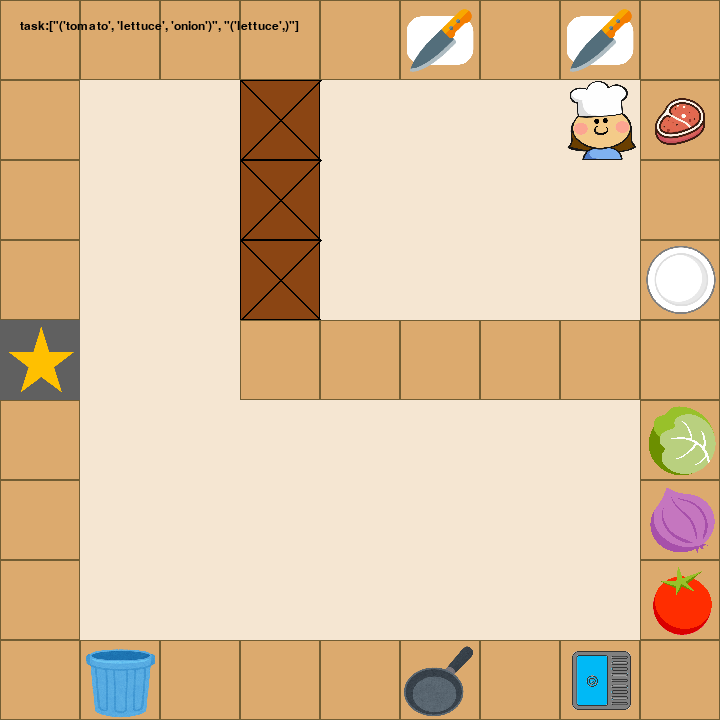

# Overcooked Plus: A Comprehensive Cooking Scenario TestBed for Enhancing the Evaluation of Autonomous Planning Algorithms
Code for "Overcooked Plus: A Comprehensive Cooking Scenario TestBed for Enhancing the Evaluation of Autonomous Planning Algorithms"

## Introduction
This work introduces Overcooked Plus, a testbed designed to evaluate the performance of autonomous systems in complex and dynamic cooking scenarios. In these scenarios, single or multiple-agent systems must complete various cooking tasks such as fetching ingredients, handling kitchen utensils, chopping, cooking, and dishwashing. The testbed aims to offer a customizable platform that supports comprehensive evaluation of planning algorithms and adaptive behaviors within autonomous systems. Key features of Overcooked Plus include controllable task difficulty, complex task constraints, multi\-task planning, dynamic environments, a graphical interface for human-on-the-loop, and a communication interface for multi\-agent systems. The paper details the system architecture and implementation of Overcooked Plus, and presents experimental setups to demonstrate its usage.



## Installation
Set up a new virtual environment
```
conda create -n overcookedPlus python==3.10.14
conda activate overcookedPlus 
```
Clone the project and install dependencies
```
git clone https://github.com/545659928/Overcooked-Plus.git
cd Overcooked-Plus
pip install -r requirements.txt
```

## Quick Start

### Simple Example for Human Players
Move with w, a, s, d keys. Interact by moving repeatedly towards the item direction.
```
python ./humanplayer_example.py
```

## Usage
The tutorial.ipynb file introduces how to use this project. (Running it requires the installation of additional Jupyter-related libraries.)


## Customization
The ./overcookedPlus/maps directory contains map configuration files (e.g., mapC.yaml), with sample.yaml providing basic parameters and usage for customization.

## References   
This work is based on the development of https://github.com/WeihaoTan/gym-macro-overcooked.

## Note
This GitHub project is currently under development.

